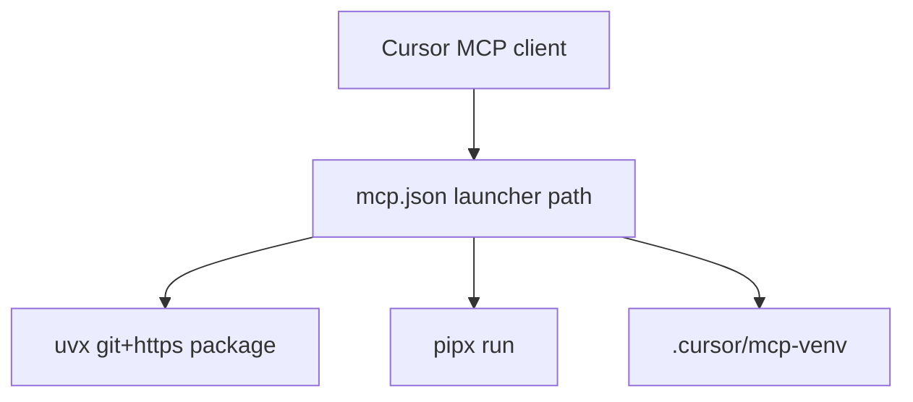

# MCP setup — clone-free (curl → mcp.json only)

Configure **office-leave** and/or **graphify** like Jira/Figma MCP: one curl per server, run from **whatever folder Cursor has open**. No `git clone` of this repo required.

**Prerequisites:** Python 3.10+ on PATH. Optional but recommended: [uv](https://docs.astral.sh/uv/) (`uvx`) or `pipx`.

---

## office-leave MCP

Sets up `.cursor/mcp.json`, `.cursor/bin/office-leave-mcp/run`, and `data/employees.db` in **the current directory only**.

For live Grok suggestions, copy `.env.example` → `.env` and set `PUTER_AUTH_TOKEN` from [puter.com/dashboard](https://puter.com/dashboard) (default provider: Puter — [free Grok tutorial](https://developer.puter.com/tutorials/free-unlimited-grok-api/)). Or set `GROK_PROVIDER=xai` and `GROK_API_KEY` for direct x.ai. The launcher loads `.env` from the workspace (never commit `.env`). Reload Cursor after changing tokens.

### curl (bash — any directory)

```bash
curl -fsSL https://raw.githubusercontent.com/devinraina258/talentserv-ai-hackathon-group-11-backend-db/main/scripts/install-office-leave-mcp.sh | bash
```

### PowerShell (Windows)

```powershell
irm https://raw.githubusercontent.com/devinraina258/talentserv-ai-hackathon-group-11-backend-db/main/scripts/install-office-leave-mcp.ps1 | iex
```

### Local (repo checkout)

```bash
python scripts/mcp_install_lib.py office-leave
```

---

## graphify MCP

Sets up `.cursor/mcp.json`, `.cursor/bin/graphify-mcp/run`, and builds `graphify-out/graph.json` in **the current directory** (AST-only, no API key).

### curl (bash)

```bash
curl -fsSL https://raw.githubusercontent.com/devinraina258/talentserv-ai-hackathon-group-11-backend-db/main/scripts/install-graphify-mcp.sh | bash
```

### PowerShell

```powershell
irm https://raw.githubusercontent.com/devinraina258/talentserv-ai-hackathon-group-11-backend-db/main/scripts/install-graphify-mcp.ps1 | iex
```

### Local

```bash
python scripts/mcp_install_lib.py graphify
```

---

## Both servers

```bash
curl -fsSL .../install-office-leave-mcp.sh | bash
curl -fsSL .../install-graphify-mcp.sh | bash
```

Or: `python scripts/mcp_install_lib.py all`

Running them in either order **merges** entries; it does not remove Jira/other MCPs.

---

## What gets written (per machine)

| Path | Purpose |
|------|---------|
| `.cursor/mcp.json` | Cursor MCP config (gitignored) |
| `.cursor/bin/*/run` | Launcher: uvx → pipx → `.cursor/mcp-venv` |
| `.cursor/mcp-venv/` | Fallback Python env (gitignored) |
| `data/employees.db` | office-leave only |
| `graphify-out/graph.json` | graphify only |

Template committed: [.cursor/mcp.json.example](../.cursor/mcp.json.example)

---

## Runtime (how the server runs)



- **office-leave:** `uvx --from git+https://github.com/devinraina258/talentserv-ai-hackathon-group-11-backend-db@main office-leave-mcp`
- **graphify:** `uvx --from graphifyy[mcp] python -m graphify.serve graphify-out/graph.json`

`${workspaceFolder}` in `mcp.json` keeps paths portable (no `C:\` or `D:\` hardcoding).

---

## After install

1. **Developer → Reload Window**
2. **Settings → MCP** → enable **office-leave** / **graphify**

---

## Developers (full repo clone)

```bash
pip install -e ".[dev,graphify]"
python scripts/bootstrap_mcp.py --all
office-leave-init-db
```

Legacy bootstrap scripts (`bootstrap-office-leave-mcp.sh`) still work inside a clone.

---

## Troubleshooting

| Symptom | Fix |
|---------|-----|
| `path not found` / Connection closed | Re-run the install curl from the folder Cursor has open |
| curl 404 | Push to GitHub `main`, or run `python scripts/mcp_install_lib.py …` from a clone |
| No `uvx` / `pipx` | Installer creates `.cursor/mcp-venv` automatically |
| graphify empty graph | Run `.cursor/bin/graphify-mcp/build-graph.sh` or `graphify update .` in workspace |
| `grok.used_grok` is false | Set `PUTER_AUTH_TOKEN` (Puter) or `GROK_API_KEY` (x.ai) in `.env`, reload MCP; check `grok.source` is `puter-api` / `grok-api` not `fallback-rules` |

---

*Repo: [talentserv-ai-hackathon-group-11-backend-db](https://github.com/devinraina258/talentserv-ai-hackathon-group-11-backend-db)*
